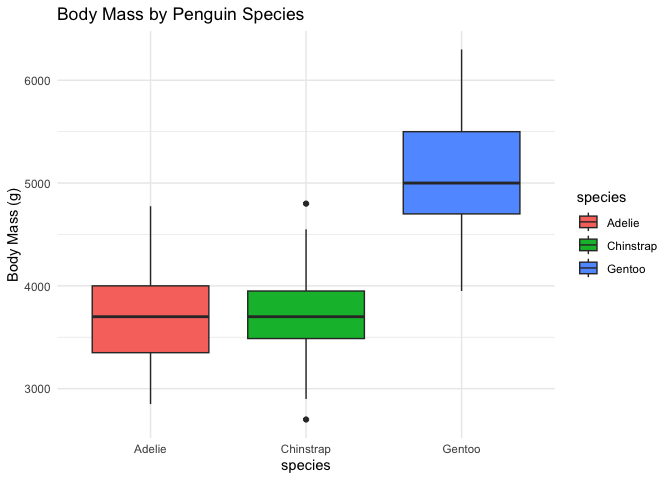
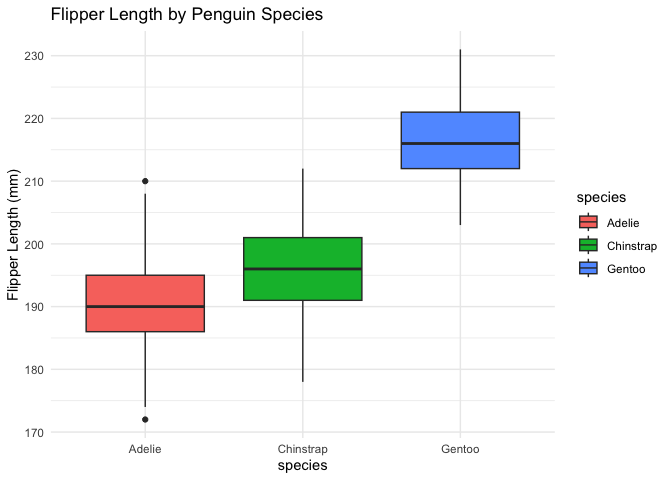
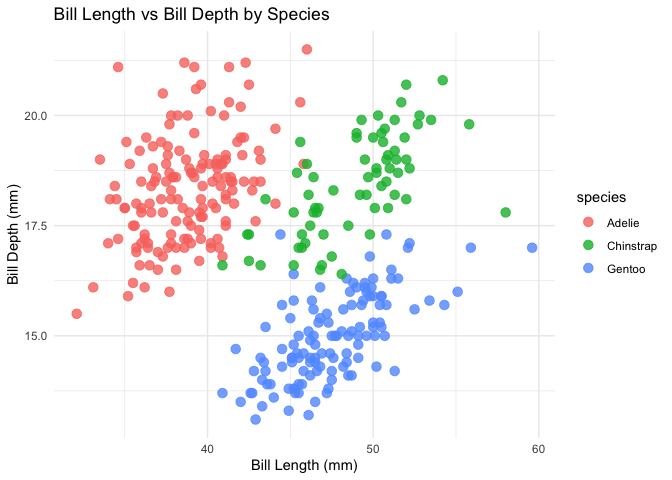
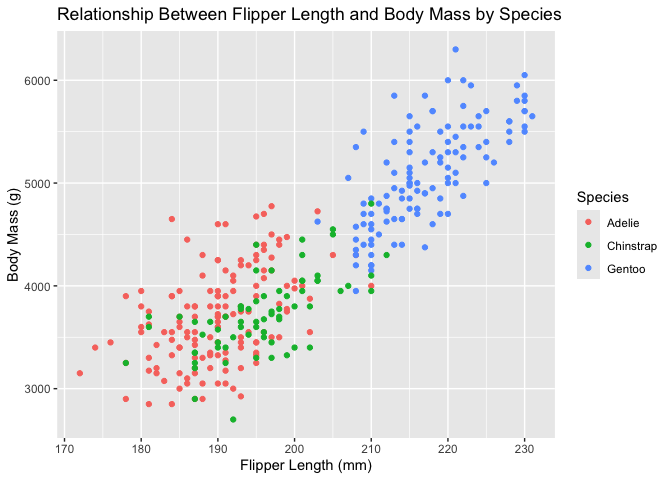
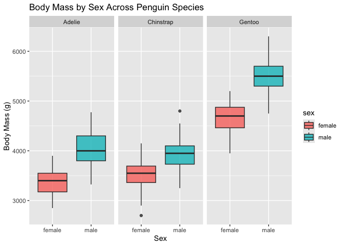

Analysis on Physical Characteristics of Penguins in the Palmer
Archipelago
================
Jyotika Sharma, Selena Cooper, Grace Kolker

## Introduction

The goal of this project is to explore the Palmer Penguins dataset to
better understand the differences in physical traits between penguin
species. This dataset includes measurements collected on three penguins
species (Adelie, Gentoo, and Chinstrap) living on multiple islands in
the Palmer Archipelago in Antarctica. By analyzing these physical
measurements, we hope to identify patterns, species differneces, and
relationships between body size variables. Understanding these traits
can help explain how environmental conditions and biological factors may
influence species variation and survival.

In pursuit of the stated goal, we will explore the following questions:

1.  How do body size measurements vary between penguin species? Are
    certain species consistently larger in one or more measurements such
    as body mass or flipper length? - Selena

2.  How do bill length and bill depth interact to help differentiate
    penguin species? Can these measurements be used to identify species
    differences effectively? - Selena

3.  Is there a relationship between flipper length and body mass across
    species? Do larger flippers indicate heavier penguins, and does this
    relationship differ by species? - Jyotika

4.  How does sex influence body size? Are male penguins consistently
    larger than female penguins across all species, and does this vary
    in strength across difference species? - Jyotika

5.  Does the island a penguins inhabits affect its body measurements?
    Are physical differences across islands still present even after
    accounting for species? - Grace

6.  Which variable (bill length, bill depth, flipper length, or body
    mass) provides the strongest prediction of species classification?
    How do combines variables compare to single-variable predication? -
    Grace

These are the main questions we intend to answer through analysis of the
Palmer Penguins dataset. With the findings, we will be able to draw
meaningful conclusions about physical trait differences and the
ecological factors that influence species variation in Antarctic
penguins.

## Data

### Structure

The link to the dataset is

``` r
library(palmerpenguins)
data(package = "palmerpenguins")
```

### Cleaning

``` r
library(tidyverse)
```

    ## ── Attaching core tidyverse packages ──────────────────────── tidyverse 2.0.0 ──
    ## ✔ dplyr     1.1.4     ✔ readr     2.1.5
    ## ✔ forcats   1.0.0     ✔ stringr   1.5.1
    ## ✔ ggplot2   4.0.0     ✔ tibble    3.2.1
    ## ✔ lubridate 1.9.4     ✔ tidyr     1.3.1
    ## ✔ purrr     1.0.2     
    ## ── Conflicts ────────────────────────────────────────── tidyverse_conflicts() ──
    ## ✖ dplyr::filter() masks stats::filter()
    ## ✖ dplyr::lag()    masks stats::lag()
    ## ℹ Use the conflicted package (<http://conflicted.r-lib.org/>) to force all conflicts to become errors

``` r
penguins_clean <- penguins |> 
  drop_na()

# Check dimensions before/after
dim(penguins)
```

    ## [1] 344   8

``` r
dim(penguins_clean)
```

    ## [1] 333   8

The Palmer Penguins dataset was already very clean and well-structured
upon import, containing properly formatted variable types and no obvious
outliers or inconsistent entries. We did not need to convert sex to
factor since it already is well. The only issues present were several
missing values in the bill measurements, flipper length, body mass, and
sex variables. To ensure accurate and consistent analysis across all
variables, we removed rows containing any missing values using
drop_na(). This reduced the dataset from 344 observations to 333
complete cases.

### Variables

``` r
dim(penguins)
```

    ## [1] 344   8

``` r
str(penguins)
```

    ## tibble [344 × 8] (S3: tbl_df/tbl/data.frame)
    ##  $ species          : Factor w/ 3 levels "Adelie","Chinstrap",..: 1 1 1 1 1 1 1 1 1 1 ...
    ##  $ island           : Factor w/ 3 levels "Biscoe","Dream",..: 3 3 3 3 3 3 3 3 3 3 ...
    ##  $ bill_length_mm   : num [1:344] 39.1 39.5 40.3 NA 36.7 39.3 38.9 39.2 34.1 42 ...
    ##  $ bill_depth_mm    : num [1:344] 18.7 17.4 18 NA 19.3 20.6 17.8 19.6 18.1 20.2 ...
    ##  $ flipper_length_mm: int [1:344] 181 186 195 NA 193 190 181 195 193 190 ...
    ##  $ body_mass_g      : int [1:344] 3750 3800 3250 NA 3450 3650 3625 4675 3475 4250 ...
    ##  $ sex              : Factor w/ 2 levels "female","male": 2 1 1 NA 1 2 1 2 NA NA ...
    ##  $ year             : int [1:344] 2007 2007 2007 2007 2007 2007 2007 2007 2007 2007 ...

There are 344 penguins in the dataset. There are 3 different species of
penguins collected from 3 different islands in the Palmer Archipelago.

- species: the biological species of each penguin (Adelie, Gentoo, and
  Chinstrap)
- island: The island within the Palmer Archipelago where the penguin was
  observed (Biscoe, Dream, and Torgersen)
- bill_length_mm: The length of the penguin’s bill (from tip to base)
  measured in milimeters
- bill_depth_mm: Thickness (depth) fo the penguin’s bill measured at the
  base in milimeters
- flipper_length_mm: Length of the penguin’s flipper from shoulder to
  tip measured in milimeters
- body_mass_g: Body weight of the penguin measured in grams
- sex: Sex of the penguin (male or female)
- year: The year the penguin was sampled during the Palmer Station field
  seasons (2007, 2008, 2009)

## Results

### How do body size measurements vary between penguin species? Are certain species consistently larger in one or more measurements such as body mass or flipper length?

``` r
ggplot(penguins, aes(x = species, y = body_mass_g, fill = species)) +
  geom_boxplot() +
  labs(title = "Body Mass by Penguin Species",
       y = "Body Mass (g)") +
  theme_minimal()
```

    ## Warning: Removed 2 rows containing non-finite outside the scale range
    ## (`stat_boxplot()`).

<!-- -->

``` r
ggplot(penguins, aes(x = species, y = flipper_length_mm, fill = species)) +
  geom_boxplot() +
  labs(title = "Flipper Length by Penguin Species",
       y = "Flipper Length (mm)") +
  theme_minimal()
```

    ## Warning: Removed 2 rows containing non-finite outside the scale range
    ## (`stat_boxplot()`).

<!-- -->

``` r
penguins %>%
  group_by(species) %>%
  summarize(
    mean_mass = mean(body_mass_g, na.rm = TRUE),
    mean_flipper = mean(flipper_length_mm, na.rm = TRUE)
  )
```

    ## # A tibble: 3 × 3
    ##   species   mean_mass mean_flipper
    ##   <fct>         <dbl>        <dbl>
    ## 1 Adelie        3701.         190.
    ## 2 Chinstrap     3733.         196.
    ## 3 Gentoo        5076.         217.

The plots and summary statistics together show clear, consistent
differences in body size among the three penguin species. Gentoo
penguins stand out as the largest across both measured traits. Their
body masses cluster around 5000 g, and their flipper lengths center near
217 mm, both substantially higher than the other species. The boxplots
also show relatively tight distributions, suggesting that Gentoos are
not only larger on average but also more uniformly large.

Adelie and Chinstrap penguins overlap more closely in size, but some
distinctions still emerge. Chinstraps tend to have slightly higher mean
values in both body mass and flipper length—about 3733 g vs. 3701 g in
mass and 195.8 mm vs. 190.0 mm in flipper length. The boxplots reflect
this modest separation: Chinstraps show a somewhat larger median and a
slightly higher overall range in both measurements. However, the overlap
between these two species indicates that size alone may not reliably
differentiate them in the field.

Overall, the results show a pattern where Gentoo penguins are
consistently the largest in both body mass and flipper length, while
Adelie and Chinstrap penguins are more similar, with Chinstraps being
marginally larger on average. These size differences may reflect
ecological distinctions among the species, such as diet, foraging range,
and habitat use.

### How do bill length and bill depth interact to help differentiate penguin species? Can these measurements be used to identify species differences effectively?

``` r
ggplot(penguins, aes(x = bill_length_mm, y = bill_depth_mm, color = species)) +
  geom_point(size = 3, alpha = 0.8) +
  labs(title = "Bill Length vs Bill Depth by Species",
       x = "Bill Length (mm)",
       y = "Bill Depth (mm)") +
  theme_minimal()
```

    ## Warning: Removed 2 rows containing missing values or values outside the scale range
    ## (`geom_point()`).

<!-- --> The
scatterplot shows that bill length and bill depth vary systematically
across the three penguin species, and these differences form distinct
clusters. Because each species occupies its own region in the
bill-length/bill-depth space, the two measurements together provide a
strong basis for distinguishing among the species.

Adelie penguins tend to have shorter bills but relatively deep ones.
Their points cluster on the left side of the plot with higher bill-depth
values. In contrast, Gentoo penguins generally have much longer bills
but are characterized by shallower depths, forming a cluster on the
right with lower vertical values. Chinstrap penguins fall between the
two—typically with moderate-to-long bill lengths and moderate-to-high
bill depths—creating their own, somewhat overlapping but still visually
separable group.

These patterns indicate that bill length alone or bill depth alone may
not cleanly separate the species, but the interaction of the two
measurements allows for clear differentiation. By examining where a
penguin falls in relation to these clusters, one can effectively predict
its species. This makes bill dimensions not just biologically meaningful
traits but also practical tools for classification.

### Is there a relationship between flipper length and body mass across species? Do larger flippers indicate heavier penguins, and does this relationship differ by species?

``` r
library(ggplot2)
library(dplyr)

penguins_clean |> 
  group_by(species) |> 
  summarize(correlation = cor(flipper_length_mm, body_mass_g))
```

    ## # A tibble: 3 × 2
    ##   species   correlation
    ##   <fct>           <dbl>
    ## 1 Adelie          0.465
    ## 2 Chinstrap       0.642
    ## 3 Gentoo          0.711

``` r
ggplot(penguins_clean, aes(x = flipper_length_mm, y = body_mass_g, color = species)) +
  geom_point() +
  labs(
    title = "Relationship Between Flipper Length and Body Mass by Species",
    x = "Flipper Length (mm)",
    y = "Body Mass (g)",
    color = "Species"
  )
```

<!-- -->

The scatterplot reveals a strong positive relationship between flipper
length and body mass across all penguin species. In general, penguins
with longer flippers tend to be heavier, and this trend is consistent
regardless of species. However, the strength and position of this
relationship differ by species, which is further supported by the
correlation values.

Gentoo penguins (blue points) clearly occupy the upper-right range of
the plot, indicating that they have both the longest flippers (around
210–230 mm) and the highest body mass (4500–6000 g). Their correlation
coefficient (r ≈ 0.71) is the strongest among the three species,
highlighting a very pronounced relationship between flipper size and
overall body mass. This suggests that Gentoos are significantly larger
overall compared to the other species.

Chinstrap penguins (green points) fall in the middle range, with
moderate flipper lengths and body mass values. Their trend line shows a
positive association supported by a moderately strong correlation (r ≈
0.64). While not as steep or wide as the Gentoo group, the Chinstrap
data still demonstrates a clear connection between flipper length and
body mass.

Adelie penguins (red points) cluster in the lower-left region,
indicating shorter flippers and lower body mass. Their positive
relationship is visible but weaker compared to the other species, which
aligns with their lower correlation value (r ≈ 0.46). This indicates
that while flipper length still relates to body mass for Adelies, the
relationship is less strong.

Overall, the plot and correlation analysis together indicate that larger
flippers correspond to heavier body mass, but the magnitude of this
relationship varies by species. Gentoo penguins exhibit the strongest
and most pronounced trend, while Adelie and Chinstrap penguins show
smaller ranges of body size. This suggests that differences in body size
are both species-specific and biologically meaningful.

After seeing a positive trend in the scatterplot, I became curious
whether the relationship looked the same within each species. To check
this, I calculated the average body mass for groups of flipper lengths:

``` r
penguins_clean$flipper_group <- cut(penguins_clean$flipper_length_mm,
                                    breaks = 4)

tapply(penguins_clean$body_mass_g,
       list(penguins_clean$species, penguins_clean$flipper_group),
       mean, na.rm = TRUE)
```

    ##           (172,187] (187,202] (202,216] (216,231]
    ## Adelie     3487.805  3771.212  4125.000        NA
    ## Chinstrap  3562.500  3648.039  4119.231        NA
    ## Gentoo           NA        NA  4798.361  5401.724

These grouped averages increased steadily within each species,
reinforcing the visual pattern that longer flippers generally correspond
to heavier penguins. Even though each species has different absolute
sizes, the upward pattern appeared in all three species, confirming the
overall positive association.

To test whether the trend was possibly driven by a few extreme values, I
examined the minimum and maximum values:

``` r
tapply(penguins_clean$body_mass_g, penguins_clean$species, range)
```

    ## $Adelie
    ## [1] 2850 4775
    ## 
    ## $Chinstrap
    ## [1] 2700 4800
    ## 
    ## $Gentoo
    ## [1] 3950 6300

``` r
tapply(penguins_clean$flipper_length_mm, penguins_clean$species, range)
```

    ## $Adelie
    ## [1] 172 210
    ## 
    ## $Chinstrap
    ## [1] 178 212
    ## 
    ## $Gentoo
    ## [1] 203 231

These ranges showed that Gentoo penguins have much larger bodies
overall, raising skepticism that part of the trend might simply reflect
species-level differences. Because each species occupies a different
size range, the overall positive trend could be partly due to species
clustering rather than a universal relationship within all penguins.
This made me cautious about assuming the trend applies equally to every
individual penguin.

### How does sex influence body size? Are male penguins consistently larger than female penguins across all species, and does this vary in strength across difference species?

``` r
penguins_clean |> 
  group_by(species, sex) |> 
  summarize(mean_mass = mean(body_mass_g, na.rm = TRUE))
```

    ## `summarise()` has grouped output by 'species'. You can override using the
    ## `.groups` argument.

    ## # A tibble: 6 × 3
    ## # Groups:   species [3]
    ##   species   sex    mean_mass
    ##   <fct>     <fct>      <dbl>
    ## 1 Adelie    female     3369.
    ## 2 Adelie    male       4043.
    ## 3 Chinstrap female     3527.
    ## 4 Chinstrap male       3939.
    ## 5 Gentoo    female     4680.
    ## 6 Gentoo    male       5485.

``` r
ggplot(penguins_clean, aes(x = sex, y = body_mass_g, fill = sex)) +
  geom_boxplot(alpha = 0.8) +
  facet_wrap(~ species) +
  labs(
    title = "Body Mass by Sex Across Penguin Species",
    x = "Sex",
    y = "Body Mass (g)"
  ) 
```

<!-- -->

The boxplot shows that male penguins are consistently larger in body
mass than female penguins across all three species, indicating a clear
pattern of sexual dimorphism in the Palmer Penguins dataset. However,
the magnitude of this size difference varies between species, which is
further supported by the mean body mass values.

For Adelie penguins, the difference between males and females is
noticeable but modest. Male Adelies have an average body mass of about
4043 g, while females average around 3369 g, placing both groups within
the 3200–4200 g range. Although their distributions overlap slightly,
the numerical means confirm a moderate sex-based size difference.

In Chinstrap penguins, the size difference between males and females
becomes more pronounced. Male Chinstraps average approximately 3939 g,
compared to 3527 g for females. This 400-gram gap, paired with the
reduced overlap in the boxplots, indicates stronger separation than
observed in Adelies.

The strongest sex difference appears in Gentoo penguins. Males are
significantly heavier, with an average mass of about 5485 g, while
females average around 4680 g. This substantial difference of more than
800 grams, along with minimal overlap in the boxplots, highlights the
most pronounced sex-based size difference across the three species.

Overall, the plot and mean mass values together demonstrate that sex
influences body size in all species, but the strength of this effect
increases from Adelie to Chinstrap to Gentoo. This suggests that sexual
dimorphism is a consistent biological pattern in penguins, though more
pronounced in some species than others.

To explore whether the differences were consistent or if a few unusual
values might be influencing the result, I looked at the standard
deviations:

``` r
tapply(penguins_clean$body_mass_g,
       list(penguins_clean$species, penguins_clean$sex),
       sd, na.rm = TRUE)
```

    ##             female     male
    ## Adelie    269.3801 346.8116
    ## Chinstrap 285.3339 362.1376
    ## Gentoo    281.5783 313.1586

Gentoo males had a standard deviation of about 313 g, noticeably larger
than Adelie females (≈269 g) or Chinstrap females (≈285 g), which shows
that body mass varies a lot within this group. This suggested to me that
the difference between male and female Gentoo penguins may not be as
uniform as the boxplot makes it appear.

### Does the island a penguins inhabits affect its body measurements? Are physical differences across islands still present even after accounting for species?

### Which variable (bill length, bill depth, flipper length, or body mass) provides the strongest prediction of species classification? How do combines variables compare to single-variable predication?

## Conclusion
